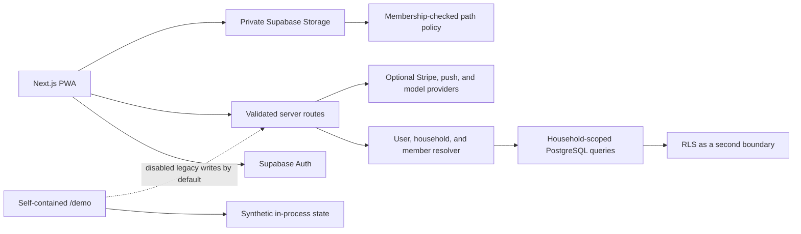

# HouseFair Architecture

## Status and Scope

HouseFair is a Next.js App Router public preview for household coordination. The repository contains two deliberately separated surfaces:

- the current multi-household application under `/app`; and
- the original single-house demo under `/demo`.

The multi-household path uses Supabase Auth, server-owned PostgreSQL access, membership-scoped records, and RLS/Storage policies. The self-contained demo supports public review and CI without production credentials.

## Request Flow

Commercial route handlers call `getHouseholdApiContext()` before reading or writing household records. That resolver:

1. resolves the Supabase user;
2. ensures the corresponding profile exists;
3. selects the user's primary active household; and
4. resolves the active membership and role.

Queries then include the resolved `household_id`, and administrative actions call an explicit role guard. Route inputs use Zod schemas and shared error handling. This keeps caller-supplied household IDs from becoming the authorization boundary.

## Data Model

The schema is evolved through ordered SQL files in `supabase/migrations/`.

Core boundaries include:

- `profiles`, `households`, and `household_members` for identity and tenancy;
- household-scoped tasks, task proof, groceries, expenses, settlements, issues, and activity;
- invite, subscription, usage, and event records; and
- private `household-uploads` objects whose path begins with a household UUID.

Foreign keys, check constraints, unique constraints, and indexes enforce structural rules. Membership functions support RLS policies for browser-readable tables and Storage objects.

## Money Flow

Expense split calculations convert the submitted amount to integer cents, distribute remainders deterministically, and convert the resulting values to fixed two-decimal records for PostgreSQL `numeric(12,2)` columns. This avoids losing a cent during equal or weighted splitting while keeping the database representation auditable.

Expense creation and split insertion currently use a compensating delete if split insertion fails. A future hardening step is to move the complete operation into one database transaction.

## PWA Cache Boundary

The service worker precaches only the public shell and static assets. Navigation requests go to the network first, authenticated HTML is not written to the cache, and `/api/` requests are excluded. When an authenticated route cannot reach the network, it receives the generic offline screen rather than cached household content.

## Provider Boundaries

Stripe, web push, and external model calls are optional. Free preview remains usable without them.

- Stripe webhook events are signature-checked and recorded for idempotency, but real end-to-end test-mode billing remains a release gate.
- Push delivery requires VAPID configuration and physical-device verification.
- Planning rules remain available without an external model, and recommendations require human review.

## Test Strategy

The current Playwright suite exercises the public pages and the self-contained demo across three mobile/PWA-oriented projects. CI also runs lint, TypeScript validation, and a production build.

Configured Supabase integration tests are not part of public pull-request CI because they require isolated infrastructure and credentials. The [production-readiness checklist](docs/PRODUCTION_READINESS.md) identifies those environment-backed checks explicitly.

## Decision Records

- [ADR 0001: Resolve household scope on the server](docs/decisions/0001-server-owned-household-scope.md)
- [ADR 0002: Use RLS as defence in depth](docs/decisions/0002-rls-defence-in-depth.md)
- [ADR 0003: Calculate splits in integer cents](docs/decisions/0003-integer-cent-split-calculation.md)
- [ADR 0004: Do not cache authenticated HTML](docs/decisions/0004-private-cache-discipline.md)
- [ADR 0005: Keep planning recommendations reversible](docs/decisions/0005-reversible-recommendations.md)

