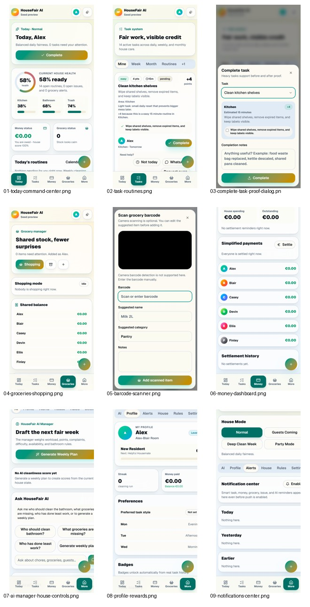
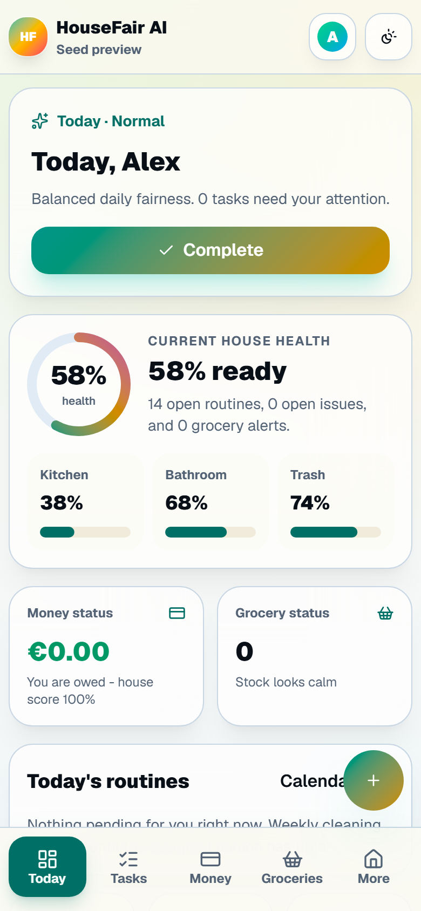
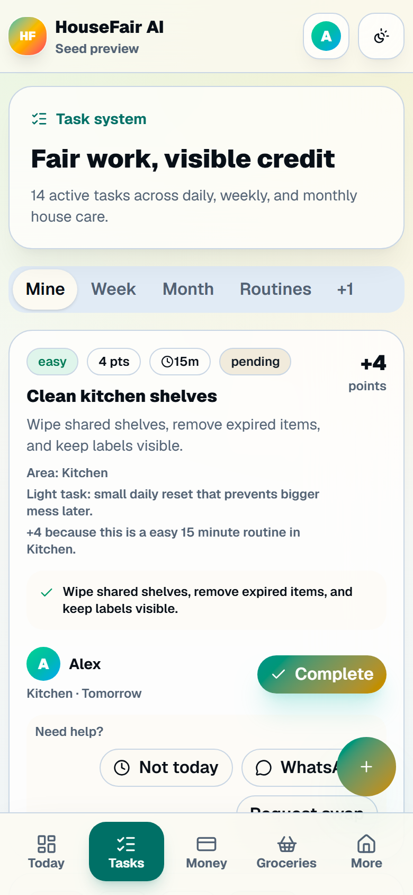
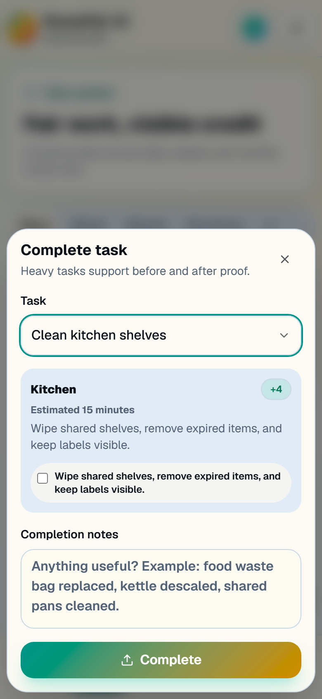
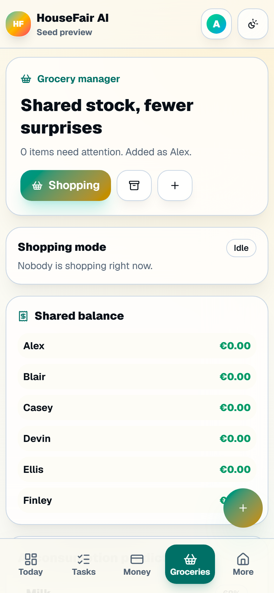
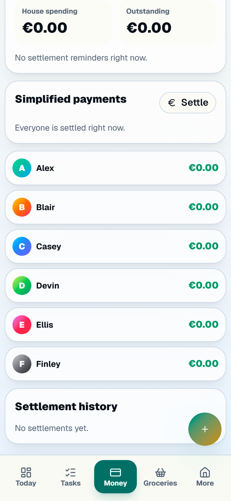
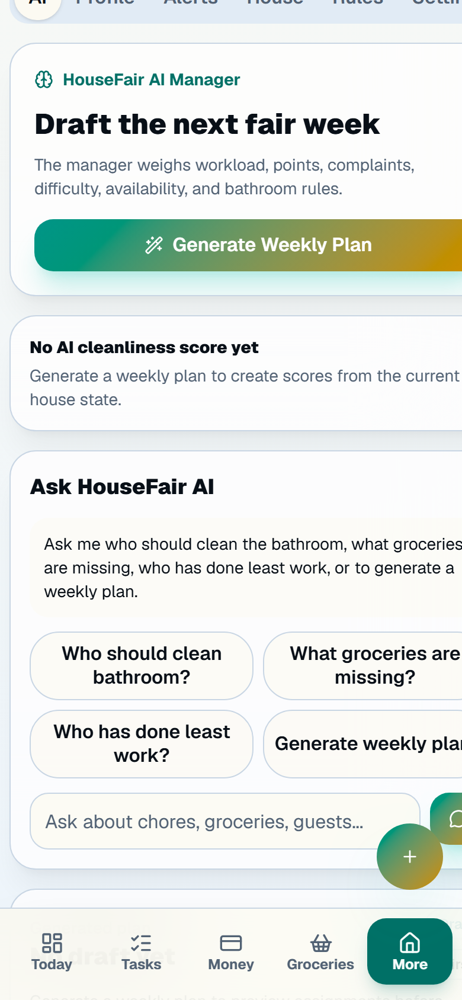
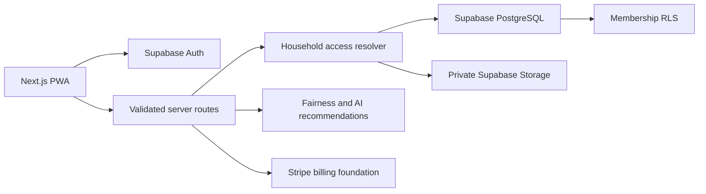

# HouseFair

**A mobile-first command center for shared homes.**

[](https://github.com/Assembler-Fourier/housefair-ai/actions/workflows/ci.yml)

[Public preview](https://housemates-sand.vercel.app) | [Architecture](ARCHITECTURE.md) | [Security model](SECURITY.md) | [Readiness](docs/PRODUCTION_READINESS.md)



I built HouseFair after living in a six-person house and seeing the same problems repeat: chores were agreed in chat and forgotten, shared shopping was scattered across messages, and nobody had a clear picture of who had paid or done the difficult jobs recently.

The first version solved that one house. The current product keeps the practical details that mattered there, but gives each household its own isolated workspace. It combines recurring cleaning routines, groceries, shared expenses, softer issue reporting, and explainable planning in one installable PWA.

HouseFair is available as a free public preview. No card is required. Legal review, production email, monitoring, physical-device checks, and end-to-end Stripe test-mode verification remain launch gates.

## The product

### A useful home screen

The Today view answers the questions people actually have when they open the app: what needs attention, what is overdue, what the house is running out of, and whether there is money to settle. Recent activity makes changes visible without turning the house into a competition.

### Chores with enough detail to be fair

- Daily, weekly, monthly, and quick routines
- Checklists, estimated time, difficulty, points, and point explanations
- Carry-over when somebody cannot complete a task that day
- Swap requests and cancellation
- Camera-only before/after proof for heavier cleaning
- Recurring task creation after completion
- Fairness suggestions based on workload, availability, history, and task difficulty

The AI manager only proposes a plan. People review it before anything is assigned, and it never applies a punishment.

### Groceries and shared money

- Shared stock states and shopping mode
- Restock predictions from purchase frequency
- Grocery-to-expense handoff
- Equal, exact, percentage, and shares-based splits
- IOUs, simplified debts, settlements, receipts, budgets, and monthly summaries
- Split calculations performed in integer cents before fixed two-decimal values are stored

### Less awkward house issues

Instead of treating every problem as a complaint, HouseFair supports a reminder, a cleanup request, or a formal report. The workflow keeps voting and dispute handling for genuine conflicts, but the everyday path stays deliberately calm.

## Screens

| Today | Tasks | Proof |
| --- | --- | --- |
|  |  |  |

| Groceries | Money | AI manager |
| --- | --- | --- |
|  |  |  |

Screenshots use anonymized demo data.

## Engineering decisions

- **Server-owned household scope.** Every commercial API request resolves the authenticated user, active household, and membership before querying data.
- **PostgreSQL as the source of truth.** Operational records are household-scoped through a server-only pooled connection, with transactions used for selected multi-step operations.
- **RLS as a second boundary.** Browser-readable Supabase tables and private Storage objects are protected by active membership policies.
- **Validated mutations.** Zod schemas, route-level authorization, rate limits, and audit activity protect high-friction actions such as uploads, expenses, tasks, and issues.
- **Private-page cache discipline.** The service worker provides an installable offline shell without caching authenticated household HTML.
- **Recommendation-only AI.** Planning remains explainable and reversible. Rules still work when no external model is configured.
- **Legacy containment.** The original single-house demo remains at `/demo`; its mutation APIs return `404` in the public product unless explicitly enabled.

The rationale and tradeoffs are recorded in [`docs/decisions/`](docs/decisions/). A fuller request and data-flow view is available in [ARCHITECTURE.md](ARCHITECTURE.md).



## Stack

- Next.js 16 App Router, React 19, and TypeScript
- Tailwind CSS 4, Radix primitives, Framer Motion, and Lucide
- Supabase Auth, PostgreSQL, Storage, and Row Level Security
- Stripe Checkout, Customer Portal, and signed-webhook foundation
- Web Push and PWA service worker
- Zod validation and PostgreSQL transactions
- Playwright mobile regression tests
- Vercel deployment

## Run it locally

Requirements: Node.js 22 or newer, a Supabase project, and PostgreSQL connection details.

```bash
npm ci
cp .env.example .env.local
npm run dev
```

Open `http://localhost:3000`. Apply the files in `supabase/migrations/` in numeric order before testing authenticated household flows.

The minimum environment is:

```bash
NEXT_PUBLIC_SITE_URL=http://localhost:3000
NEXT_PUBLIC_SUPABASE_URL=
NEXT_PUBLIC_SUPABASE_ANON_KEY=
DATABASE_URL=
HOUSEFAIR_ACCESS_MODE=free
LEGACY_PRIVATE_APP_ENABLED=false
```

Stripe, VAPID, model-provider, admin, and maintenance variables are optional until those integrations are enabled. Secrets must never use the `NEXT_PUBLIC_` prefix.

## Verification

```bash
npm run typecheck
npm run lint
npm run build
npm run test:e2e
npm audit --omit=dev
```

The regression suite is configured for a 390px Android viewport, an iPhone PWA viewport, and an Android PWA viewport. It covers public pages and the demo workflow, including identity and PIN confirmation, tasks and proof, groceries, money, profile, notifications, planning, settings, and horizontal overflow.

GitHub Actions runs lint, production build, and the mobile Playwright suite for every change to `master` and every pull request.

## Current status

The deployed build is a public technical preview suitable for controlled testing, not a claim of general production readiness. Before inviting unmanaged public users or enabling paid access, it still needs reviewed legal copy, production email delivery, external error monitoring, end-to-end Stripe test-mode checks, commercial notification scheduling, and physical-device checks for install, camera, and notifications.

That distinction matters to me. A feature existing in a codebase is not the same as proving it under real production conditions.

## Repository map

```text
src/app/                 App Router pages and server routes
src/components/saas/     Authenticated household product UI
src/lib/saas/            Household access, domain logic, and data services
src/lib/server/          Server-only database and security helpers
supabase/migrations/     Schema, RLS, and Storage policies
tests/                   Mobile Playwright regression suite
public/                  PWA manifest assets, icons, and service worker
docs/                    Readiness, threat model, screenshots, and decision records
```

## Known limitations

- The public legal, refund, and privacy pages are technical placeholders awaiting professional review.
- Paid access is not verified end to end and should remain disabled.
- Public CI uses the self-contained demo path; authenticated database and storage policy behavior requires a configured Supabase test environment.
- In-memory rate-limit fallbacks are process-local and are not a substitute for a distributed production limiter.
- Email, push delivery, camera capture, PWA install, and notification permissions still need physical-device and provider-backed verification.

See [the production-readiness checklist](docs/PRODUCTION_READINESS.md) for the release boundary.

## License

The source is publicly visible for transparency and technical review, but it is not open source. See [LICENSE](LICENSE).
